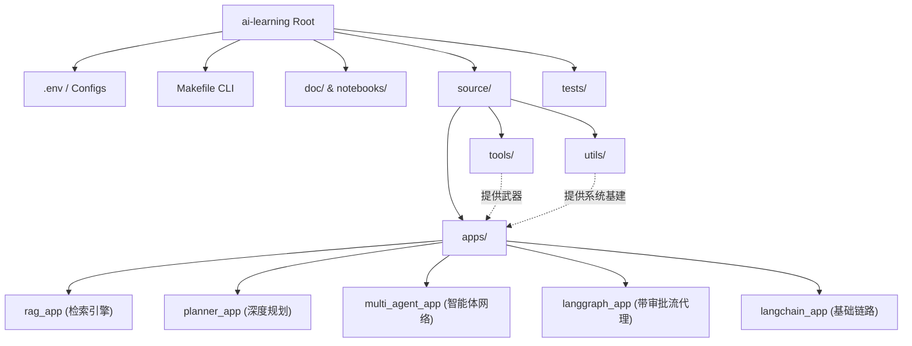

# AI-Learning: 现代化 AI 应用架构实验场

本项目是一个基于 **LangChain 0.3+**、**LangGraph** 和 **MCP (Model Context Protocol)** 的全栈 AI 实验场。它展示了如何构建一个高度模块化、具备实时感知能力、且拥有人工干预机制的智能体系统。

## 🏗️ 全局架构与模块系统解析

本项目并非一个简单的 Demo，而是一套**从底层大模型微调到顶层多智能体编排的完整工程化体系**。它的目录结构遵循严格的职责分离原则（Separation of Concerns）。



### 1. 业务应用层 (`source/apps/`)
这是项目的核心大脑区域，展示了 AI 能力从简单到复杂的演进链路：
*   **`langchain_app/` (基础层)**：传统的顺序执行链。展示了最原始的工具调用（Tool Calling），但没有循环与反思能力。
*   **`rag_app/` (知识大脑)**：实现了一套具备工业价值的 **Active RAG** 引擎。它抛弃了传统的单向量检索，引入了“向量+关键词”的**混合召回 (Hybrid Retrieval)**，并在此之上挂载了 Cross-Encoder 的**深度重排 (Rerank)**。
*   **`langgraph_app/` (状态机核心)**：引入了状态图 (StateGraph) 和循环 (Cyclic Graph) 机制。AI 在这里学会了试错与重试，并且独家集成了 **HITL (Human-in-the-Loop 人工审批流)**，在执行危险工具前会挂起等待控制台授权。
*   **`multi_agent_app/` (多体协作)**：打破了单一大模型的知识局限，构建了一个智能体网络。展示了 `Researcher` (负责广泛拆解与检索) 如何将状态数据无缝传递给 `Writer` (负责深度整合与输出)。
*   **`planner_app/` (深度规划)**：应对极端复杂任务的 **Plan-and-Execute** 模式。抛弃了 ReAct 走一步看一步的短视问题，强迫 AI 先生成全局 JSON 清单，再交由 Executor 逐项无情执行，最后由 Replanner 动态复盘。
*   **`mcp_app/` (跨界总线)**：展示了如何接入外部的 MCP (Model Context Protocol) 协议服务。

### 2. 基础设施层 (`source/tools/` & `source/utils/`)
*   **`source/tools/` (能力库)**：这是智能体的感官和手脚。集中定义了所有跨 App 共用的能力（如天气查询、数学沙箱、MCP 服务暴露）。遵循“一处定义，处处挂载”的原子化原则。
*   **`source/utils/` (系统基建)**：对 AI 隐藏的底层框架。包含单例模式的模型工厂 `factory.py`、带有文件持久化机制的结构化日志组件 `logger.py`，以及集中掌控环境变量与路径的 `config.py`。

### 3. 实验与质量保障 (`notebooks/` & `tests/`)
*   **`notebooks/` (模型微调实验室)**：完全脱离业务代码的离线实验田。包含 Qwen 和 Llama 模型基于 Unsloth 的量化微调 (SFT) 脚本，甚至是目前最前沿的 GRPO 强化学习对齐 (RLHF/R1) 脚本。
*   **`tests/` (自动化集成测试)**：保障架构演进不翻车的底线。每次提交前通过 `make test` 验证所有的 LangGraph 图连线、工具参数与配置加载是否完美。

## 🛠️ 技术选型原理

1.  **两阶段检索架构**：在 `source/apps/rag_app` 中实现召回与精排分离，显著提升回答质量。
2.  **混合存储策略**：
    *   **短时记忆**：默认使用 **`:memory:`** 以规避并发冲突。
    *   **长时知识**：通过配置文件指定磁盘持久化路径。
3.  **组件工厂模式**：通过 `source/utils/factory.py` 统一创建 LLM 与 Embeddings。

## 🚀 运行与维护

本项目引入了 **Makefile** 以简化开发流程，并集成了 **GitHub Actions** 进行自动化质量监控。

```bash
# 1. 运行自动化系统测试 (验证工程地基)
make test

# 2. 运行现代化 RAG 应用 (Recall -> Rerank 架构)
make rag

# 3. 启动多智能体协作实验室
make multi

# 4. 运行高级深度规划实验室 (Plan & Execute)
make plan

# 5. 运行带审批流的智能体 (LangGraph HITL)
make graph

# 6. 启动 MCP 服务总线
make mcp
```

## 🔍 调试与监控 (LangSmith)

本项目深度集成了 **LangSmith**。如需启用：
1. 在根目录下修改或新建 `.env`，设置 `LANGSMITH_TRACING=true`。
2. 填入您的 `LANGSMITH_API_KEY`。
3. 访问 [LangSmith 控制台](https://smith.langchain.com) 查看全链路 Trace。

## 📄 深度指引与原理
*   **[手把手原理与代码指引](./doc/Walkthrough.md)**：详细解析 RAG、LangGraph 与 MCP 的底层流转逻辑。
*   **[AI 知识全景路线图](./doc/AI_Knowledge_Roadmap.md)**：覆盖从硬件到 Agent 治理的全维技术栈。

## 🧠 核心逻辑流转 (Step-by-Step)

1.  **用户输入** -> `source/apps/rag_app` 启动混合检索。
2.  **知识召回** -> `ModernHybridRetriever` (Chroma + BM25) 粗筛。
3.  **精排重排序** -> `ModernReranker` 深度对齐，锁定最强上下文。
4.  **智能体决策** -> `source/apps/langgraph_app` 分析上下文并生成 `tool_calls`。
5.  **人工审批 (HITL)** -> 系统在执行工具前自动挂起，等待 `make graph` 控制台确认。
6.  **最终输出** -> 总结所有知识与工具结果，输出精准答复。
