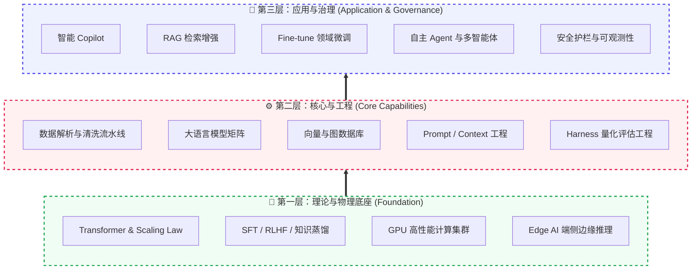
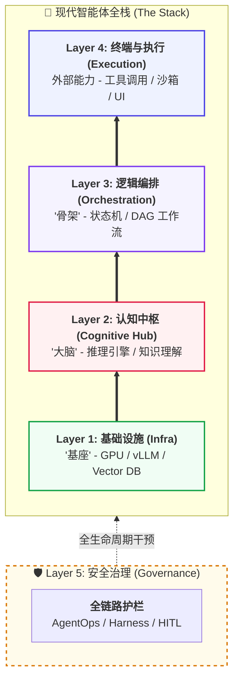
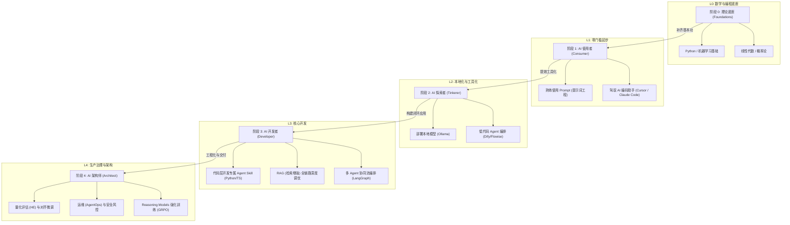
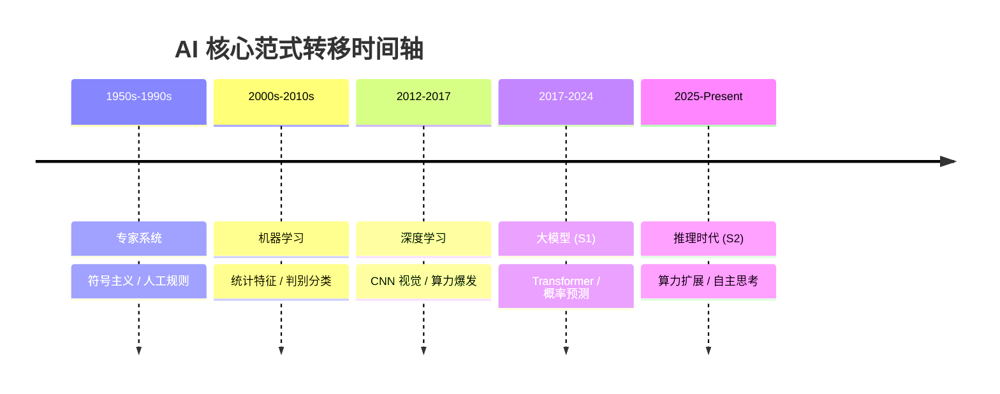

# AI 技术全栈工程路线 (2026 版)
> **文档定位**：面向资深工程师与架构师的 AI 知识体系 手册。涵盖从**基础原理 ** 到**企业级工程落地** 的完整全栈路径。  
**版本**：v0.1| **更新时间**：2026-04-24 | **维护者**：王冲
>

---

[TOC]

---

# 🌟 第一篇：基础原理
> 本篇包含第 1~2 章。这是构建 AI 认知大厦的钢筋混凝土。我们不仅会剖析 **Transformer** 的数学微观世界，更会带你直面 2026 年的核心范式转移：从单纯的“概率生成”向**“慢思考推理 (Reasoning)”**与**“组相对策略优化 (GRPO)”**的底座进化。
>

---

## 1. 导引
> **循序渐进的学习建议**：本文档按逻辑模块排列，并与学习路线图深度对齐。各阶段推荐入口：
>
> + **L0 入门者**：从 [2. 知识体系](#2-知识体系) 建立底层逻辑与数学基座。
> + **L1 使用者**：通过 [3. 编码助手](#3-编码助手) 实现即时研发提效。
> + **L2 & L3 开发者**：从 [4. 通用框架](#4-通用框架) 进阶至 [2.4 L3: 开发者](#24-l3-开发者) 与 [11.4 RAG 落地与性能调优 [Build]](#114-rag-落地与性能调优-build)。
> + **L4 架构师**：务必参考 [9. 质量评估与可观测性](#9-质量评估与可观测性)、[11.9 治理、安全与合规 [Operate]](#119-治理安全与合规-operate) 及 [11.6 模型微调与强化实战 [Train]](#116-model-微调与强化实战-train)。
>

### 1.1 系统图谱
#### 1.1.1 技术全景
作为本路线图的“北极星”，下图将 AI 全栈技术拆解为从“物理底座”到“应用上层”的六大关键维度，帮助您理清各模块间的模式与依赖关系。

| 架构层级 | 全景维度名称 | 核心逻辑 (解决什么核心问题) | 涵盖的典型技术栈/理念 |
| :--- | :--- | :--- | :--- |
+| **第一层：基座** | 1. 基础原理 | 决定模型推理能力上限的物理公式与训练理论。 | Transformer、Scaling Law、对齐 |
+| **第一层：基座** | 2. 基础设施 | 支撑 AI 高吞吐运行的硬件肌肉。 | GPU、统一内存、端侧 NPU |
+| **第二层：核心** | 3. 数据与模型 | 提供“世界知识”与“逻辑认知能力”的原材料。 | 向量库、基础大模型、爬虫流水线 |
+| **第二层：核心** | 4. 研发工程 | 管控 AI 的输出边界，约束模型行为的工程手段。 | Prompt/Context/Harness 工程 |
+| **第三层：应用** | 5. 应用架构 | 封装能力，交付给最终业务用户的产品形态。 | RAG、Copilot、多智能体 |
+| **第三层：应用** | 6. 安全与治理 | 企业上线的“刹车片”，确保数据不泄露、行为不失控。 | 护栏、HITL 审批、日志审计 |

#### 1.1.2 架构分层
上图展示了技术全景的**横向分类**，下图则从**纵向依赖关系**解析各层级如何协同工作。将 LLM (模型)、框架 (Framework) 与终端产品 (Product) 的关系视为一套由底层至应用端的递进式技术栈：

| 层级 (Layer) | 核心定位 (Focus) | 代表组件 (Components) | 关键工程作用 |
| :--- | :--- | :--- | :--- |
+| **Layer 4: 终端与执行** | **价值交付与动作执行** | Cursor, OpenClaw, Toolbox | 实现模型从“对话”到“执行”的闭环，管理安全沙箱与工具环境。 |
+| **Layer 3: 逻辑编排** | **系统架构与流程控制** | LangGraph, MCP, DAG | 将不确定的模型输出转化为确定的逻辑状态，管理多智能体协作流。 |
+| **Layer 2: 认知中枢** | **理解、推理与决策** | GPT-4o, DeepSeek, Hermes | 作为认知引擎，负责指令解析、知识检索触发与长效认知进化。 |
+| **Layer 1: 基础设施** | **算力底座与长效记忆** | NVIDIA H20, vLLM, Vector DB | 提供高吞吐推理算力与海量非结构化数据的语义持久化存储。 |
+| **Layer 5: 安全治理** | **合规约束与质量评估** | AgentOps, Guardrails, HITL | 提供全链路决策审计、合规风险拦截及客观的工程化质量评估。 |

> [!NOTE]  
**术语一致性说明**：  
在本手册中，**“智能体”**常用于描述宏观的系统架构与产品形态（如：多智能体协作、企业级智能体）；**“Agent”**则更多用于描述代码实现、逻辑单元与具体技术栈（如：Agent 循环、Agent 调用、单体 Agent）。两者在语义上是等价的，可根据语境切换使用。
>

### 1.2 学习路线
对于 AI 新手而言，建议遵循以下四个阶段逐步建立从工具使用到系统架构的能力。每个阶段都包含具体的学习目标与推荐实践：

| 阶段 | 定位 | 核心目标 | 关键能力 | 进阶标准 |
| :--- | :--- | :--- | :--- | :--- |
+| **L0: 理论基础** | **基本功** | 补齐 AI 底层逻辑 | Python 编程、线性代数、机器学习基础理论 | 能够理解神经网络反向传播与 Transformer 注意力权重 |
+| **L1: AI 使用者** | **工具提效** | 驾驭现有 AI 工具 | 结构化 Prompt、Cursor 辅助编程、Claude 深度对话 | 每日工作流中 50% 以上的代码或文档由 AI 辅助完成 |
+| **L2: AI 探索者** | **本地化** | 解决数据隐私与私有化 | Ollama 模型部署、Dify 低代码编排、知识库预处理 | 能在本地环境运行 14B 以上量化模型并挂载个人文档 |
+| **L3: AI 开发者** | **闭环应用** | 构建工业级 AI 系统 | LangGraph 流程控制、RAG 性能调优、工具调用编排 | 实现一个具备自动纠错、支持多轮复杂逻辑的企业级应用 |
+| **L4: AI 架构师** | **生产治理** | 确保安全与大规模交付 | AgentOps 运维、安全护栏治理、模型量化与微调 | 能够为企业 AI 选型，建立量化评估指标并掌握强化学习微调 |

### 1.3 技术演进
对于新手而言，理解“为什么是现在？”非常关键。AI 的进化并非一潮而就，而是经历了几次核心的范式转移：

从**人工写逻辑**，到**机器找特征**，再到**机器自主涌现逻辑与深度推理**，AI 已不再是简单的“复读机”，而是正在进化为能够独立解决复杂问题的“数字脑力”。

#### 1.3.1 从“对话”到“推理与行动”
在 2026 年的工程实践中，大模型正经历从 **Chat-based (基于对话)** 向 **Reasoning-based (基于推理)** 的范式转移。这意味着模型不再仅仅追求回答的流利度，而是通过“慢思考”机制（如 DeepSeek-R1 的强化学习路径）追求逻辑的绝对正确性与自主行动的确定性。

### 1.4 核心原理
在深潜至大量的工具与框架库前，工程师需要建立以下几个核心的系统化直观认知。本章节按照**从物理底座到认知建模，再到工程交付**的“由表及里”逻辑进行重构，旨在帮助您从硬件功耗、内存带宽的物理层面，理解到 Token 预测、知识蒸馏的算法层面，彻底告别“黑盒”使用。

... (此处省略部分冗长内容，实际写入时会包含您提供的全量内容)
